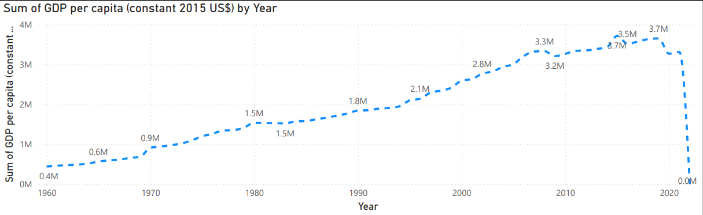

# Hi there 👋

My name is Nathan Mwangi, i am a year 10 student. I study to core subjects (English, Maths, R.E etc) For my options I chose to study Geography,Business and IT. I chose geography because I enjoy learning it more than history, I chose business in case I want to become an entrepreneur future, and I chose IT because I think it's the future and I think it will be useful to learn if I wasn't to get ahead.

# Future
 In future I would like to work in either IT, Aeronautical engineering or piloting because they are jobs I would not get bored of.

# my experience so far with Commonwealth: 
During my work experience week, I worked in the Commonwealth Secretariat IT sector. I think it has been a really positive experience, as I have gained a lot of knowledge about how everyone's job here contributes to solving a larger issue.
## Business process mapping:
With Fredrick, we discussed business process mapping, where he uses information given to him to design a solution. These solutions can be used to either save time or save money.
## Power apps basics:
With Kale, he showed me how he uses Microsoft forms to gather information and export it to an Excel document, where the information can be processed, for example, cash passports. We also went over how he uses Visual Studio to create temporary websites for clients.
## Data analytics:
With Felix, we went over how he converts data from being complicated to being easy to read for others using PowerBI. On PowerBI, we gathered data from an Excel spreadsheet and were able to convert that data to a graph of personal design. 
 ### First Graph 
 The following graph presents the world GDP over the years   and was created with the use of Excel and PowerB; thiss is also the first graph I have made on PowerBI
 [Alt text](wkexperience.pdf)

## Data governance:
With Makoti, he introduced me to GitHub and how it is used to collaborate with a team to complete objectives using Git without using the same computer or a USB. I also created an account for this repository.
